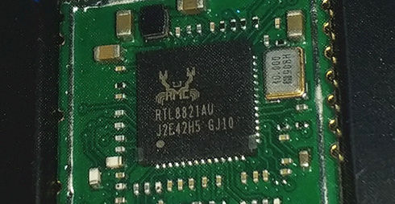

# rtw88-openwrt 🚀
Package and tools for [Linux rtw88](https://github.com/lwfinger/rtw88) driver for OpenWrt 23.05 and 24.10.

With this repo, you can build ready-to-use modules with the latest fixes for your router. You can test patches from rtw88 devs too :)

## Support
- RTL8812AU
- RTL8821AU
- RTL8811AU
- RTL8822BU
- RTL8812BU
- RTL8822CU
- RTL8821CU
- RTL8811CU
- RTL8723DU

## Thanks
Thanks to henkv1 for the original repo: https://github.com/henkv1/rtw88-usb-openwrt/

## How to Use
### Build the modules using the premade patch

- Download the SDK for your device if you are using the official OpenWrt stable binaries, like 23.05.5. Download the OpenWrt source code from git otherwise (branch openwrt-23.05).
- Update the package feeds: ./scripts/feeds update -a ; ./scripts/feeds install -a (see: https://openwrt.org/docs/guide-developer/toolchain/using_the_sdk for information on using the SDK)
- Run make menuconfig.
- Clone this repository on the folder package/kernel/rtw88.
- There are two patches: for 23.05 and 24.10. Delete the file that you won't need.
- (For SDK) Compile the package: make package/rtw88-usb/compile

The firmware package is named rtw88-firmware{...} and you can find it in the bin/packages/{architecture}/base/ directory. 
The kernel module package is named kmod-rtw88-usb_{...} and you can find it in the bin/target/{architecture}/{model}/packages/ directory. You can copy both packages to your device and install it using opkg install {package}. 

Please note that you need to install *both* packages for your device to make the module work.

### Build the patch

rtw88 is not directly compatible with OpenWrt. This is because OpenWrt uses a hybrid codebase (for example, 23.05 uses Linux 5.15 with mac80211 backports from 6.1), and kernel version checks by rtw88 must be modified with a patch.

You can generate your own patch if the rtw88 repo has been updated, or you want to test or revert some code and the provided patch does not work anymore.

This only work for OpenWrt 23.05 and 24.10 target devices.

- Clone the original rtw88 repo.
- Optionally update the code or apply all patches do you want.
- From this repo, execute `tools/rtw88-patcher-openwrt-23.05.sh` or `tools/rtw88-patcher-openwrt-24.10.sh` inside the rtw88 tree.
- Generate a patch file with `git diff > rtw88-openwrt.patch` inside the rtw88 tree.
- Put the `rtw88-openwrt.patch` in the folder "patches", on a local copy of this repo.

